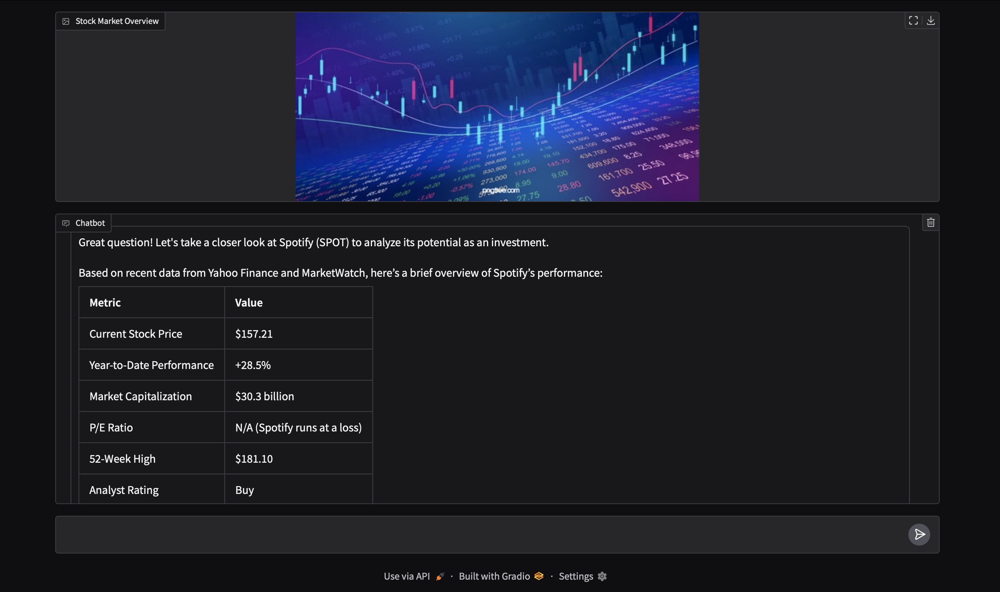

## Finance Chatbot (Side Project)

### ⚠️ Disclaimer: This chatbot is for demonstration and educational purposes only. It provides a "percent chance" of stock performance, but these are estimates and should not be used as actual investment advice.


 
### Overview
This is a simple chatbot application powered by OpenAI's GPT-4 model, specifically designed to help users analyze and receive financial advice regarding stocks. It provides insights based on real-time data from popular stock websites. The chatbot also generates percentage estimations of how likely a stock will appreciate over time.
 
The chatbot interface is interactive and includes a background stock market image to enhance the experience. Users can ask questions about specific stocks, and the chatbot will provide data-backed responses, including performance analysis, investment recommendations, and risk assessment. 
 
### Key Features
- **Stock Analysis**: The chatbot provides stock price analysis and recommendations based on online sources.
- **Financial Forecasting**: It gives a percentage chance that a stock will appreciate, based on available data.
- **Interactive Interface**: The user interacts with the bot via a friendly and clean interface with a stock market background image.
- **Gradio Interface**: Built using Gradio for easy-to-use and visually appealing chat UI.
 
### Technologies Used
- **OpenAI GPT-4**: To power the chatbot's natural language processing and analysis.
- **Gradio**: To create the interactive web-based chat interface.
- **Python**: Used for implementing the backend logic and data integration.
- **PIL (Pillow)**: Used to load and display stock images.
- **Environment Variables**: For securing API keys using Python's `dotenv` library.
 
### Demo

  
*Example of the stock market overview displayed on the interface.*

### How to Run Locally

## Python Version

This project was developed and tested with Python 3.10.5. Please ensure that you're using this version or a compatible version for optimal performance.

You can check your Python version with the following command:

```bash
python --version
```

1. **Clone this repository** to your local machine:
```bash
git clone https://github.com/yourusername/finance-chatbot.git
cd finance-chatbot
```


2. **Install required dependencies**:
```bash
pip3 install openai gradio python-dotenv matplotlib Pillow requests
```
 
3. **Set up your OpenAI API key**:
- Create a `.env` file in the project directory and add your OpenAI API key:
```
OPENAI_API_KEY=your-openai-api-key-here
```
 
4. **Run the application**:
```bash
python3 app.py
```

5. Open the application in your browser at `http://127.0.0.1:7876/`.


### How It Works
The chatbot uses the GPT-4 model to simulate a financial advisor that provides investment advice based on user queries. The system fetches information from popular stock resources (as mentioned in the system prompt) and then formats the response using markdown, tables, and other formatting techniques to guide the user on their investment journey.


### Future Improvements
- **Stock Data Integration**: Incorporate real-time stock data APIs to provide more up-to-date financial information.
- **Charts/Graphs**: Add features that can generate visual representations (like line charts or bar graphs) of stock performance.
- **Enhanced User Experience**: Improve conversational UI/UX and add more personal features (like user preferences).
- **Predictions with ML**: Integrate machine learning models to better predict stock trends.
